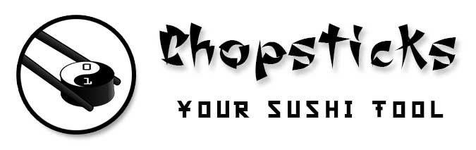
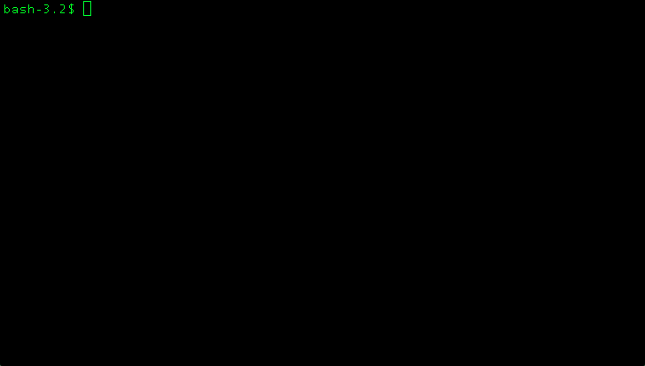
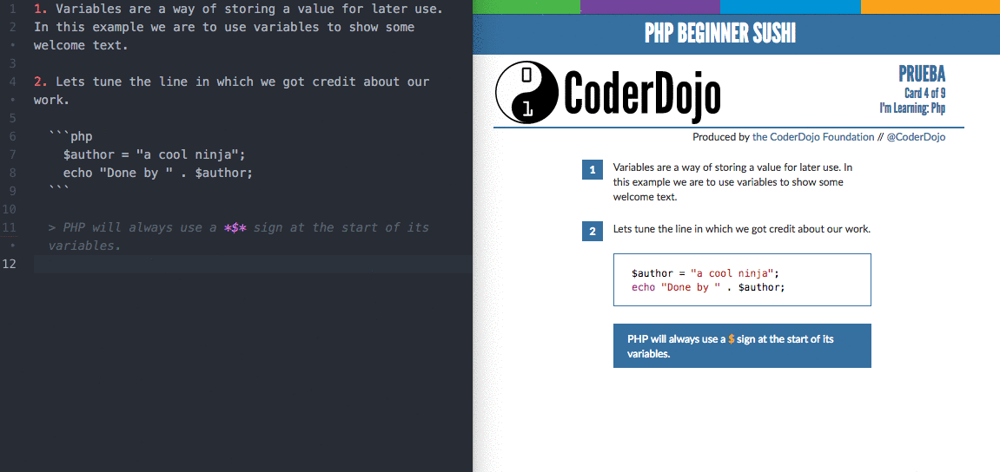

# chopsticks (sushi-tool)

This tool has been designed to help you to create and maintain your sushi cards.

With chopstick you can do the following tasks:

* Init a sushi card project
* Add sushi cards sheets to your project
* Start a live mode to see the result of compiling your sushi cards. This live mode use the livereload feature, which refresh your browser automatically every time you save your markdown file.
* Compile your sushi card markdown files into a set of pdfs or a single one.

## Install chopsticks

```bash
npm install -g sushi-tool
```

## Use chopsticks

```bash
$ mkdir my-sushi-set
$ cd !^
$ chopsticks init
```

### Init command

Initialize a folder to star creating a sushi card

```bash
$ chopsticks init
```



### Live command

This mode allow you to edit your sushi cards and see the result in your every time you save your file without the need of refreshing it.

```bash
$ chopsticks live
```



### PDF command

This command allow you to render your sushi cards in a set of pdfs or a single one.

To generate a **set of pdfs** execute the following command in your project folder:

```bash
$ chopsticks pdf output_folder
```

To generate a **single pdf** add the merge (-m) option.

```bash
$ chopsticks pdf -m output.pdf
```


### Sync command

If you create new markdown files, you can update your configuration file using the following command.

```bash
$ chopsticks sync
```

## Dependencies

To use the pdf generation you need to have installed ```phantomjs```, install it using ```npm```:

```bash
$ sudo npm install -g phantomjs
```

To merge your pdf filesthe ```pdfunite``` command line tool, which uses the `poppler` library.

### Linux

Install the `poppler-utils` package using your package manager.

### OS X

Install `poppler` using Homebrew.
