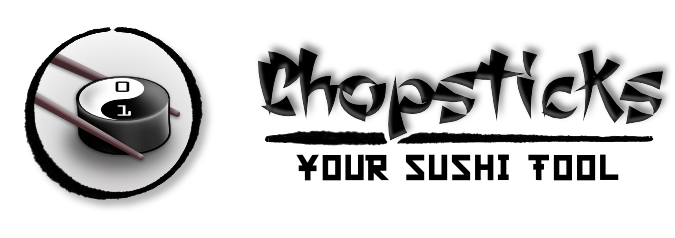

# chopsticks (sushi-tool)

This tool has been designed to help you to create and maintain your sushi cards.

With chopstick you can do the following tasks:

* Init a sushi card project
* Add sushi cards sheets to your project
* Start a live mode to see the result of compiling your sushi cards. This live mode use the livereload feature, which refresh your browser automatically every time you save your markdown file.
* Compile your sushi card markdown files into a set of pdfs or a single one.

## Install chopsticks

```bash
npm install -g sushi-tool
```

## Use chopsticks

```bash
$ mkdir my-sushi-set
$ cd !^
$ chopsticks init
```

### Init command

Initialize a folder to star creating a sushi card

```bash
$ chopsticks init
```


### Live command

This mode allow you to edit your sushi cards and see the result in your every time you save your file without the need of refreshing it.

```bash
$ chopsticks live
```


